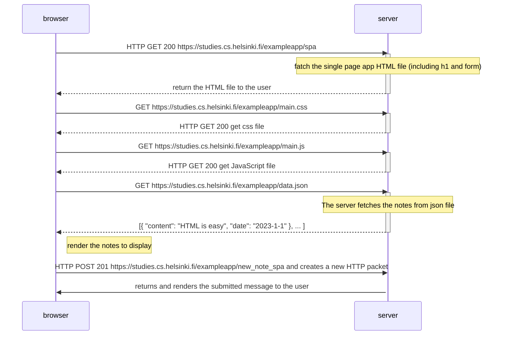

New Note Single Page App Diagram

```mermaid
sequenceDiagram
    participant browser
    participant server

    browser->>server:   HTTP GET 200 https://studies.cs.helsinki.fi/exampleapp/spa
    activate server
    note over server: fatch the single page app HTML file (including h1 and form)
    server-->>browser: return the HTML file to the user
    deactivate server

    browser->>server: GET https://studies.cs.helsinki.fi/exampleapp/main.css
    activate server
    server-->>browser: HTTP GET 200 get css file
    deactivate server

    browser->>server: GET https://studies.cs.helsinki.fi/exampleapp/main.js
    activate server
    server-->>browser: HTTP GET 200 get JavaScript file
    deactivate server


    browser->>server: GET https://studies.cs.helsinki.fi/exampleapp/data.json
    activate server
    note over server: The server fetches the notes from json file
    server-->>browser: [{ "content": "HTML is easy", "date": "2023-1-1" }, ... ]
    deactivate server
    Note right of browser: render the notes to display

    browser->>server: HTTP POST 201 https://studies.cs.helsinki.fi/exampleapp/new_note_spa and creates a new HTTP packet
    activate server
    server->>browser: returns and renders the submitted message to the user


    
```